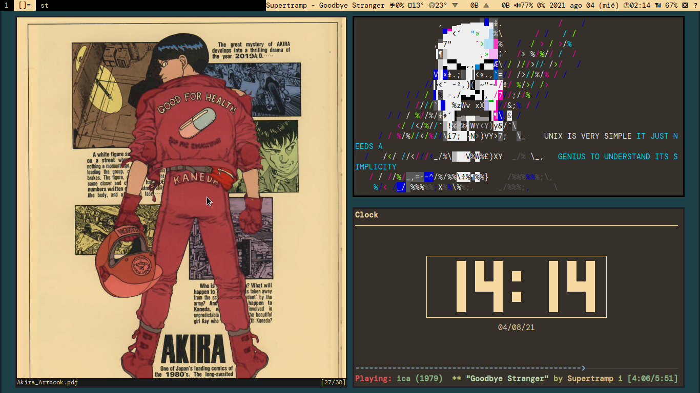

# DOTFILES

## Presentación

Archivos básicos de configuración personal. Simplemente, se trata del esquema de colores de [Fmash16](https://github.com/fmash16/dotfiles) en [LARBS](https://larbs.xyz/) de [Luke Smith](https://lukesmith.xyz/).

Tienen un carácter personal, pero cualquiera puede utilizarlo.

Saludos!

## Paquetes adicionales que requieren instalación:

* Fuentes: Nerd Fonts, DM mono.
* xflux.
